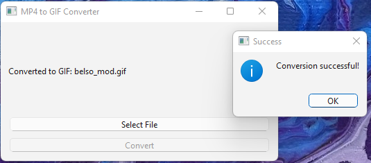

# MP4 to GIF Converter

The MP4 to GIF Converter is a simple desktop application built with Python and PyQt6. Its primary purpose is to enable 
users to easily convert MP4 videos to GIFs. The application provides a straightforward user interface, making the 
conversion process as smooth and intuitive as possible.

***
## Features
- **Simple and Intuitive Interface**: The application features a clean and user-friendly interface that allows users to 
  convert MP4 videos to GIFs with ease.
- **MP4 File Selection**: Users can browse their local files and select the desired MP4 video for conversion.
- **GIF Conversion**: Converts the selected MP4 video into an animated GIF with a single click.
- **User-Friendly Design**: Clean, minimal design for ease use, perfect for both beginner and advanced users.
- **Instant Feedback**: Displays conversion progress and success message upon completion.

***
## Requirements

### Libraries

* Python 3.8+
* PyQt6: A set of Python bindings for the Qt application framework, used for creating the application's GUI.
* moviepy: A Python library for video editing, used for converting MP4 videos to GIFs.

You can install the required libraries using the following commands:

```bash
pip install PyQt6 moviepy
```
### Operating System

The application is compatible with Windows, macOS, and Linux operating systems.
***
## Installation

1. Clone the repository to your local machine:

```bash
git clone
```
2. Navigate to the project directory:

```bash
cd mp4-to-gif-converter
```
3. Install the required libraries:

```bash
pip install PyQt6 moviepy
```
4. Run the application:

```bash
python main.py
```
***
## Usage

1. Launch the application by running the `main.py` script.
2. Click on the `Select MP4 File` button to browse and select the MP4 video you want to convert.
3. Click on the `Convert to GIF` button to start the conversion process.
4. Wait for the conversion to complete. You will see a progress bar indicating the conversion progress.
5. Once the conversion is complete, you will see a success message with the path to the converted GIF file.
6. You can click on the `Open GIF File` button to open the folder containing the converted GIF file.
7. You can repeat the process to convert more MP4 videos to GIFs.

***

## Screenshots



***
## Notes

- Ensure thet the input file is a valid MP4 video file, otherwise the app may not perform as expected.
- MoviePy may take some time to convert the video to GIF, depending on the video's length and resolution.
- The converted GIF file will be saved in the same directory as the input MP4 file.
- The application may not work as expected if the required libraries are not installed or if there are compatibility issues with the operating system.

***
## License

This project is licensed under the MIT License. See the [LICENSE](LICENSE) file for more information.
